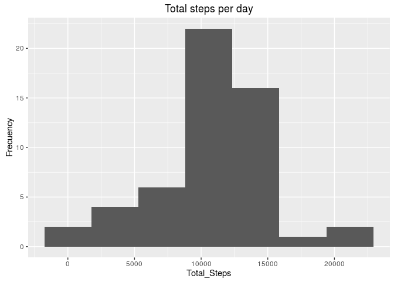
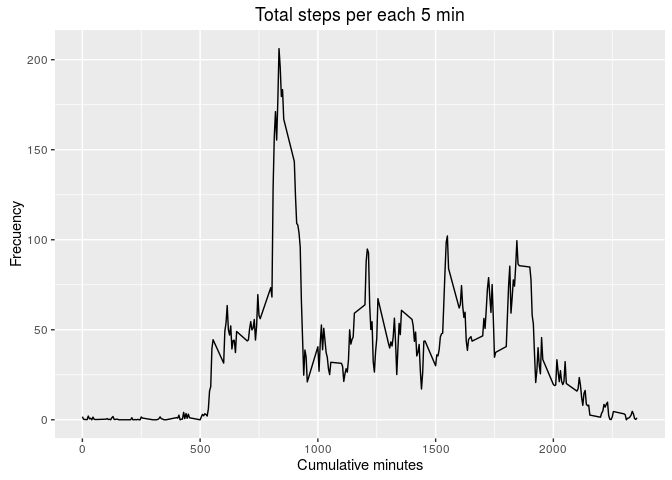
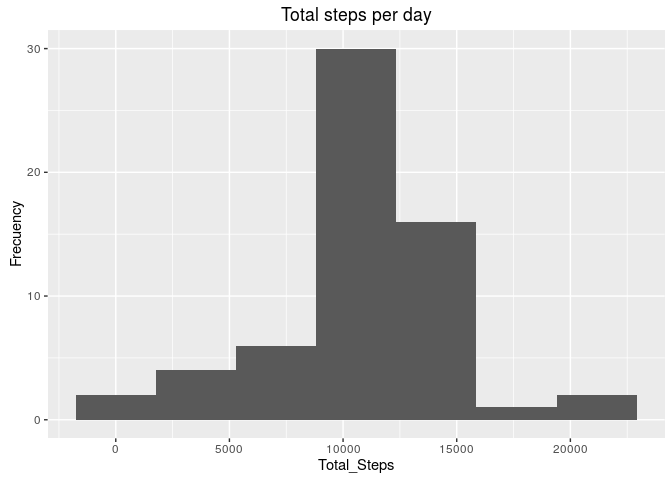
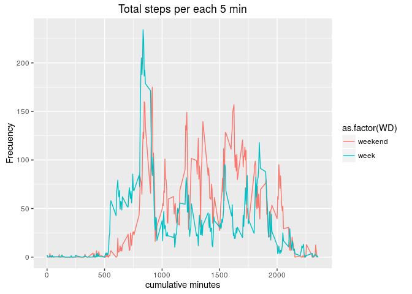

# Reproducible Research: Peer Assessment 1
Carlos A. Giménez  
July 30, 2016  


## Loading and preprocessing the data
### The variables included in this dataset are:

- steps: Number of steps taking in a 5-minute interval (missing values are 
coded as 𝙽𝙰)
- date: The date on which the measurement was taken in YYYY-MM-DD format
- interval: Identifier for the 5-minute interval in which measurement was taken


```r
sampleData <- read.csv("activity.csv", header = TRUE)
str(sampleData)
```

```
## 'data.frame':	17568 obs. of  3 variables:
##  $ steps   : int  NA NA NA NA NA NA NA NA NA NA ...
##  $ date    : Factor w/ 61 levels "2012-10-01","2012-10-02",..: 1 1 1 1 1 1 1 1 1 1 ...
##  $ interval: int  0 5 10 15 20 25 30 35 40 45 ...
```

```r
head(sampleData)
```

```
##   steps       date interval
## 1    NA 2012-10-01        0
## 2    NA 2012-10-01        5
## 3    NA 2012-10-01       10
## 4    NA 2012-10-01       15
## 5    NA 2012-10-01       20
## 6    NA 2012-10-01       25
```
## What is mean total number of steps taken per day?

Process data

```r
df1 <- sampleData %>%
  na.omit() %>%
  group_by(date) %>%
  summarize(sum(steps)) %>%
  mutate(date = as.Date(date, format = "%Y-%m-%d"))

names(df1) <- c("Date", "Total_Steps")
```
Plot data frame

```r
ggplot(data.frame(df1), aes(x=Total_Steps)) + 
  labs(title = "Total steps per day", y ="Frecuency")+
  geom_histogram(fill="lightblue") +
  stat_bin(bins=7)
```

```
## `stat_bin()` using `bins = 30`. Pick better value with `binwidth`.
```

<!-- -->

## What is the average daily activity pattern?

```r
mean(df1$Total_Steps)
```

```
## [1] 10766.19
```

```r
median(df1$Total_Steps)
```

```
## [1] 10765
```


```r
df2 <- sampleData %>%
  na.omit() %>%
  group_by(interval) %>%
  summarize(mean(steps))

names(df2) <- c("Interval", "Mean_Steps")
```
Plot Total steps per each 5 min

```r
ggplot(df2, aes(x=Interval, y=Mean_Steps)) + 
  labs(title = "Total steps per each 5 min", y ="Frecuency", x ="Cumulative minutes")+
  geom_line()
```

<!-- -->

Print the interval with max value 


```r
df2 %>% 
  filter(Mean_Steps == max(Mean_Steps)) 
```

```
## Source: local data frame [1 x 2]
## 
##   Interval Mean_Steps
##      (int)      (dbl)
## 1      835   206.1698
```

## Imputing missing values
Calculate and report the total number of missing values in the dataset (i.e. the total number of rows with NAs)


```r
nrow(filter(sampleData, is.na(steps)))
```

```
## [1] 2304
```

Devise a strategy for filling in all of the missing values in the dataset. The strategy does not need to be sophisticated. For example, you could use the mean/median for that day, or the mean for that 5-minute interval, etc.


```r
func_comp <- function(steps, interval) {
    filled <- NA
    if (!is.na(steps))
        filled <- as.numeric(steps)
    else
        filled <- (df2[df2$Interval==interval, "Mean_Steps"])
    return(filled)
}
data2 <- sampleData
data2$steps <- mapply(func_comp, data2$steps, data2$interval)
```
Process data2

```r
df3 <- data2 %>%
  group_by(date) %>%
  summarize(sum(as.numeric(steps))) %>% 
  mutate(date = as.Date(date, format = "%Y-%m-%d"))
  
names(df3) <- c("Date", "Total_Steps")
```
Plot data frame

```r
ggplot(data.frame(df3), aes(x=Total_Steps)) + 
  labs(title = "Total steps per day", y ="Frecuency")+
  geom_histogram(fill="lightblue") +
  stat_bin(bins=7)
```

```
## `stat_bin()` using `bins = 30`. Pick better value with `binwidth`.
```

<!-- -->

## What is the average daily activity pattern?

```r
mean(df3$Total_Steps)
```

```
## [1] 10766.19
```

```r
median(df3$Total_Steps)
```

```
## [1] 10766.19
```

## Are there differences in activity patterns between weekdays and weekends?


```r
days <- as.POSIXlt(sampleData$date, format = "%Y-%m-%d")
WeekDays <- days$wday
table(WeekDays)
```

```
## WeekDays
##    0    1    2    3    4    5    6 
## 2304 2592 2592 2592 2592 2592 2304
```

```r
WeekDays[WeekDays == 0 | WeekDays == 6] = "weekend"
table(WeekDays)
```

```
## WeekDays
##       1       2       3       4       5 weekend 
##    2592    2592    2592    2592    2592    4608
```

```r
WeekDays[WeekDays  != "weekend"] = "week"
table(WeekDays)
```

```
## WeekDays
##    week weekend 
##   12960    4608
```

```r
WeekDaysFactor <- factor(WeekDays, levels = c("weekend", "week"))
sampleData$WD <- WeekDaysFactor

df4 <- sampleData %>%
  na.omit() %>%
  group_by(interval, WD) %>%
  summarize(mean(steps))

names(df4) <- c("interval", "WD", "Mean_Steps")
```
I think this kind of graphics is more interesting and more easy
for analysis

```r
ggplot(df4, aes(x=interval, y=Mean_Steps, color =as.factor(WD))) + 
  labs(title = "Total steps per each 5 min", y ="Frecuency", x ="cumulative minutes")+
  geom_line()
```

<!-- -->
